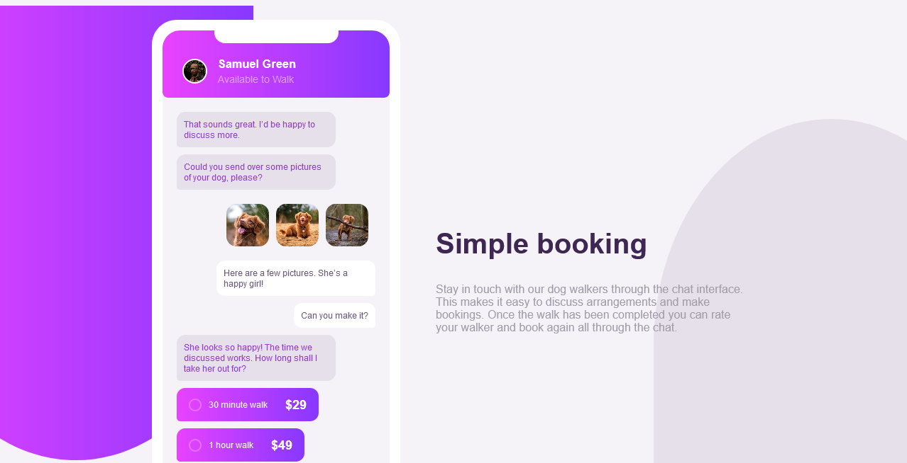

# Frontend Mentor - Chat app CSS illustration solution

This is a solution to the [Chat app CSS illustration challenge on Frontend Mentor](https://www.frontendmentor.io/challenges/chat-app-css-illustration-O5auMkFqY). Frontend Mentor challenges help you improve your coding skills by building realistic projects. 

## Table of contents

- [Overview](#overview)
  - [The challenge](#the-challenge)
  - [Screenshot](#screenshot)
  - [Links](#links)
- [My process](#my-process)
  - [Built with](#built-with)
  - [What I learned](#what-i-learned)
  - [Useful resources](#useful-resources)
- [Author](#author)


## Overview

### The challenge

Users should be able to:

- View the optimal layout for the component depending on their device's screen size
- See the chat interface animate on the initial load

### Screenshot




### Links

- Solution URL: [Add solution URL here](https://your-solution-url.com)
- Live Site URL: https://glitch1904.github.io/chat-illustration/

## My process

### Built with

- Semantic HTML5 markup
- SASS(Used Visual Studio Code Live Compiler)
- Flexbox
- Desktop-first workflow
- Font=> Family:[Rubik](https://fonts.google.com/specimen/Rubik)


### What I learned
I used this project to reinforce my knowledge of SASS and the use of SASS nesting. Along with my knowledge of "@keyframes" animations in CSS

To see how you can add code snippets, see below:

(code snippet of CSS animation)
```css
@keyframes moveFromRight {
  0% {
    opacity: 0;
    transform: translateX(3rem);
  }

  40% {
    transform: translateX(-1rem);
  }

  100% {
    opacity: 1;
    transform: translateX(0rem);
  }
}
```

### Useful resources
-https://fontawesome.com/ - This helped me with using external icons. I really liked this pattern and will use it going forward.

## Author

- Website - Boluwatife Olusanya
- Frontend Mentor - [@gLitCH1904](https://www.frontendmentor.io/profile/gLitCH1904)
- Twitter - [@t3ch_spawn](https://twitter.com/t3ch_spawn?t=Ov_f3rOf0XsthvKc_3YFpA&s=09)


